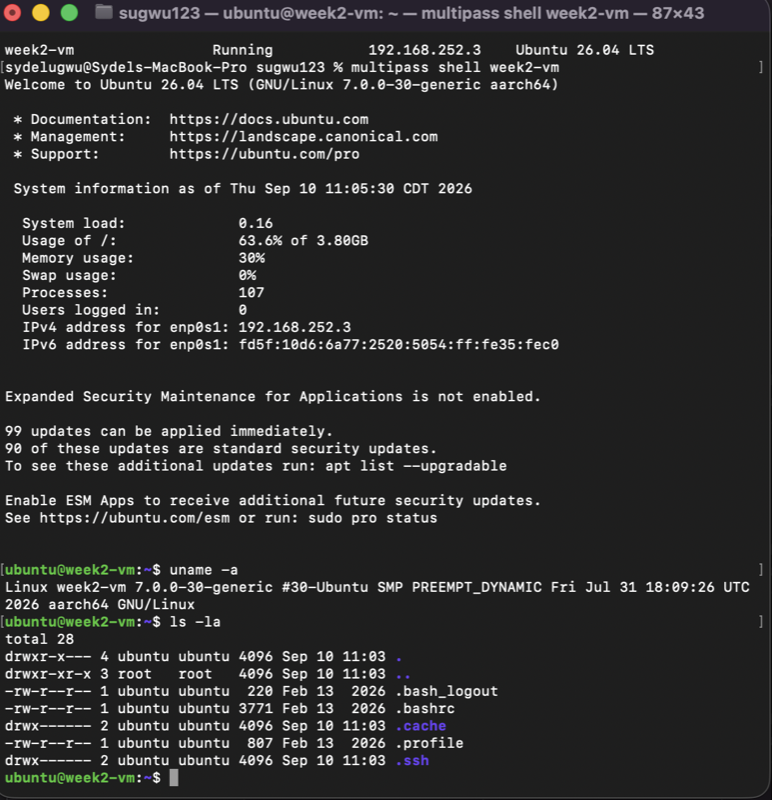

# Local VM

## 1. Prerequisites

The requirements for this setup are a Mac computer, the Terminal application, Multipass, and an internet connection. macOS already includes a terminal, so no additional terminal application was needed. I used Multipass as the hypervisor to run an Ubuntu virtual machine locally on my Mac.

## 2. Installation of the Hypervisor

I installed Multipass on my Mac using the official installer from Canonical. After the installation was complete, I checked that Multipass was working correctly by running:

~~~bash
multipass version
~~~

## 3. VM Creation and Login

I used Multipass to set up an Ubuntu virtual machine named `week2-vm`.

I checked the status of the virtual machine with:

~~~bash
multipass list
~~~

After the VM was running, I logged into it with:

~~~bash
multipass shell week2-vm
~~~

After logging in, the terminal showed the Ubuntu prompt:

~~~text
ubuntu@week2-vm:~$
~~~

I verified that the virtual machine was working correctly by running:

~~~bash
uname -a
~~~

I also ran:

~~~bash
ls -la
~~~

The `uname -a` command displayed information about the Linux system, and `ls -la` displayed the files and directories in the current directory.

## 4. Screenshot

The screenshot below shows the successful login to the Ubuntu virtual machine and the commands used to verify that it was working.

## 5. System-Specific Quirks

I completed this assignment on a Mac using Multipass. One issue I encountered was initially trying to create and edit my GitHub assignment files while I was inside the Ubuntu virtual machine. The assignment files needed to be created in my local GitHub repository on my Mac, so I exited the VM and returned to the Mac Terminal before working with the repository files.

I also had to pay attention to which terminal environment I was using. The `ubuntu@week2-vm:~$` prompt means that I am inside the Ubuntu virtual machine, while my normal Mac Terminal prompt means that I am working on my Mac.

## 6. Contributing

If an error is found in the official lecture notes, a contributor can fork the lecture-notes repository, make the necessary correction, commit the change, push the change to their fork, and submit a pull request to the original repository.

## Version Information

### macOS

The macOS version can be checked with:

~~~bash
sw_vers
~~~

### Multipass

The Multipass version can be checked with:

~~~bash
multipass version
~~~

### Ubuntu

The Ubuntu version can be checked from inside the virtual machine with:

~~~bash
lsb_release -a
~~~

## Command-Line VM Creation

The Ubuntu virtual machine can be created from the command line with:

~~~bash
multipass launch --name week2-vm
~~~

The VM can be checked with:

~~~bash
multipass list
~~~

The VM can be accessed with:

~~~bash
multipass shell week2-vm
~~~

The VM can be stopped with:

~~~bash
multipass stop week2-vm
~~~

The VM can be started again with:

~~~bash
multipass start week2-vm
~~~
