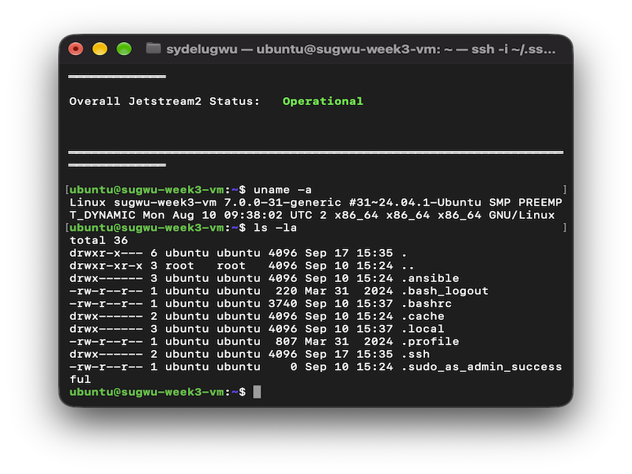
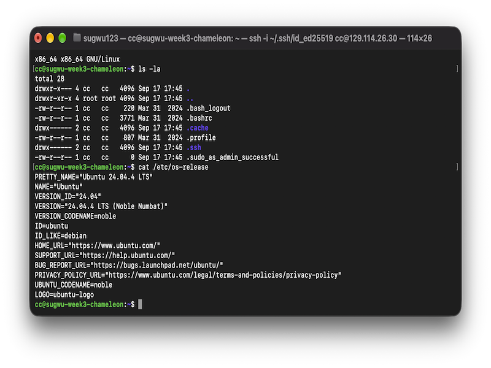

# Jestream VM

A Jetstream 2 virtual machine was created using an Ubuntu 24.04 image. The VM was accessed through SSH after attaching a floating IP address. Commands such as `uname -a` and `ls -la` were used to verify that the virtual machine was running correctly.

# Chamelon Cloud VM

A Chameleon Cloud virtual machine was created using the CC-Ubuntu24.04 image. The portal was explored before creating the reservation, an SSH public key was uploaded, and the reservation was kept under one hour. The smallest listed flavor, m1.tiny, was attempted first, but it did not successfully launch the Ubuntu 24.04 image. The next smallest compatible flavor, m1.small, was used successfully. The VM was accessed through SSH with the `cc` username, and terminal commands were used to verify the system.

# Comparing VM Creation

Creating a local VM is more direct because the virtual machine runs on the computer's own hardware. The local setup mainly requires choosing a virtualization tool, selecting an operating system, and starting the machine.

Jetstream 2 requires more cloud configuration. An SSH key, application credentials, OpenStack command-line tools, a VM flavor, an image, and a floating IP address are needed before the machine can be accessed remotely.

Chameleon Cloud also requires additional cloud configuration. A lease must be created before launching the virtual machine, and the correct image, compatible flavor, SSH key, security group, and floating IP must be configured. Chameleon also uses the `cc` account for SSH access to its supported images.

All three methods create a virtual machine that can run Linux commands, but the cloud platforms require more networking and resource management than a local VM. Jetstream 2 focuses heavily on OpenStack command-line management, while Chameleon Cloud uses a reservation-based workflow through its web portal.
