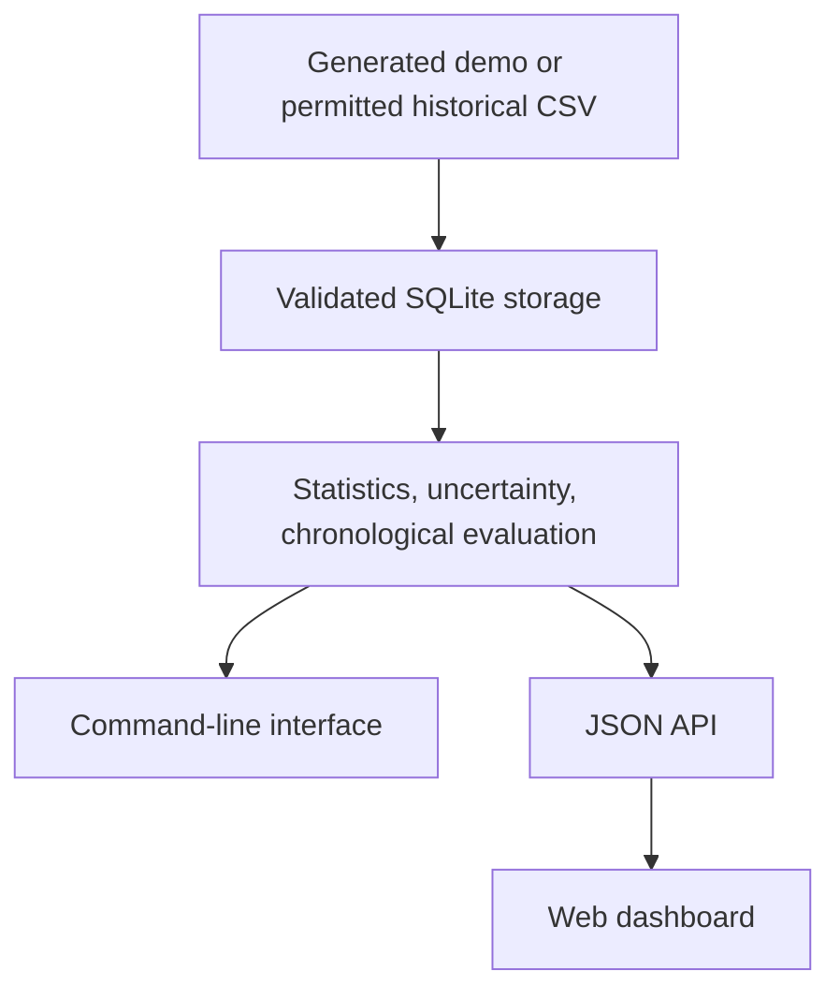

# Sports Statistics and Probability Analysis Platform

## Executive Summary

The goal of this project is to create a cloud-based application that analyzes sports statistics and uses historical data to estimate probabilities for different sports outcomes. Users will select a team, player, or matchup and view statistics and probability-based analysis through a web interface. The project combines software engineering, cloud computing, data analysis, and potentially AI.

This is a solo project. The midterm prototype uses fictional basketball observations to demonstrate the workflow. Real historical sports data and real-world predictive performance are not established by the demo.

## Objectives

1. Collect and organize historical sports statistics.
2. Create statistical models that calculate estimated probabilities.
3. Develop a web application where users can view sports data and analysis.
4. Store and process data using cloud services.
5. Explore how AI can be used to explain statistical results.
6. Practice software development, GitHub, cloud deployment, and DevOps concepts.

## Scope

### In Scope

- Team and player statistics
- Historical game data and performance trends
- Probability calculations with uncertainty
- Data visualization and a web dashboard
- Cloud-based data storage and processing
- Possible AI-generated explanations of results

### Out of Scope

- Guaranteed predictions
- Real-money betting functionality
- Training a large AI model from scratch
- Expensive commercial data services

## Research Question

How well does a historical points-threshold baseline estimate subsequent outcomes, and how does its error change when the analysis is limited to a particular player or opponent?

The prototype compares a smoothed historical-rate baseline with a constant 50% baseline using chronological Brier scores. Results from generated data verify the evaluation workflow. Answering the sports research question requires a permitted historical dataset and a documented evaluation on real observations.

## Architecture

The same analysis runs through the CLI and API. The dashboard is an optional visual interface for comparing trends and uncertainty. A dedicated Multipass VM is the first deployment target, consistent with the course's allowance for local cloud simulation. A future sports API adapter and optional AI explanations remain planned extensions.

## Midterm Progress and Evidence

| Original objective | Prototype connection | Remaining evidence |
| --- | --- | --- |
| Historical statistics | Validated CSV import with source and rights metadata; generated demonstration data | Select and import a permitted real dataset |
| Probability models | Historical threshold rate, 95% Wilson interval, chronological baseline evaluation | Evaluate real observations and discuss limitations |
| Web application | Team, player, and opponent filters; chart and recent observations | Verify the dashboard from the Mac and capture a demo |
| Cloud storage and processing | Automated Multipass deployment succeeded; guest tests and health check passed | Verify stop/start persistence |
| AI explanations | Optional future extension | Decide whether it helps explain verified results |
| GitHub and DevOps | Published prototype, CLI, API, Makefile, verification tests, and Week 5 contribution | Keep progress commits and deployment evidence |

- [Runnable prototype and instructions](sports/README.md)
- [Midterm progress report](project/project.md)
- [Midterm preparation checklist](project/midterm-checklist.md)
- [Prototype verification](project/verification.txt)
- [Sports VM deployment evidence](project/vm-deployment.md)
- [Week 5 infrastructure contribution](assignments/week5/README.md)

The Week 5 test VM was used for cloudmesh-ai-vm validation. It does not demonstrate that the sports application was deployed. The sports deployment script uses native Multipass commands because the recorded Week 5 `cmx info`, `run`, and resume behavior still require fixes.

## Development Notes

Week 3 Git command-line practice was completed. The project continues in this course repository. Formal instructor approval is not documented here and must be confirmed before claiming that the project has been approved.
