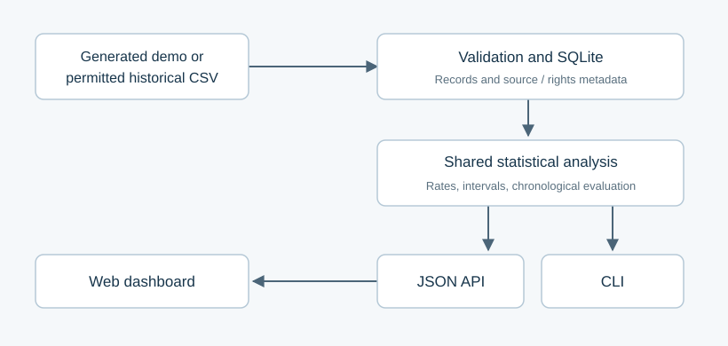

# Sports Statistics and Probability Analysis Platform: Midterm Progress

Sydel Ugwu

## Abstract

This project develops a sports analytics application that organizes team and
player observations and evaluates probability estimates for points thresholds.
The current prototype combines validated CSV ingestion, persistent SQLite
storage, descriptive statistics, a historical exceedance rate, a Wilson confidence
interval, and a chronological evaluation of a smoothed baseline. The analysis is
available through both a command-line interface and a JSON API, with a dashboard
for inspecting trends and selected matchups. Generated basketball observations
provide a reproducible demonstration without distributing raw external data.
Twenty-three automated tests passed in a Python 3.12 environment, including tests
for statistical reference values, prevention of same-day evaluation leakage,
dataset validation, and agreement between CLI and API results. These results
establish prototype behavior rather than predictive accuracy on real sports.
Week 5's VM contribution provides related infrastructure experience, with eight
successful checks and three unresolved failures. The automated Multipass deployment
completed on the student's Mac, with all 23 tests passing inside the guest and
a healthy service response. The next milestones are a permitted historical
dataset, real-data evaluation, dashboard and persistence verification,
and confirmation of instructor approval.

**Keywords:** sports analytics, probability, uncertainty, cloud automation, reproducibility

## Introduction

The [original proposal](../project.md) calls for a cloud application combining
team/player statistics, historical game data, estimated probabilities, and a
web dashboard. The midterm milestone focuses on a points-based basketball
workflow. This is a solo project.

The research question is whether a historical points-threshold baseline estimates
subsequent outcomes better than a constant 50% probability, and how the error
changes with player or opponent filters. A generated-data demonstration cannot
answer this question empirically. It establishes a pipeline that can later be
evaluated on permitted historical observations.

## Background and Architecture

SQLite supplies local persistent storage without a separate database server.[^sqlite]
Figure 1 shows the prototype's shared analysis path. The CLI covers data creation,
import, and analysis; the dashboard visualizes results from the same API logic.
This visual interface is justified by the need to inspect performance sequences
and uncertainty alongside numeric output.

*Figure 1. Data validation and persistent storage feed a shared analysis layer,
accessible through a CLI and JSON API. The dashboard consumes the API.*

The VM target is a dedicated local Multipass instance, using the course's permitted
local cloud simulation. The application runs as a service in the guest. Sports API
collection and optional AI explanations remain outside the current implementation.

## Methodology

The demo generator creates a fixed-seed fixture with 144 player observations,
36 games, four fictional teams, and eight fictional players. CSV ingestion
requires source and usage-rights metadata. Validation rejects duplicate
player/game records, inconsistent scorelines, invalid dates, and invalid scores
before replacing existing records in a transaction.

The team view counts each game once even when several players are recorded.
Player and opponent selections narrow the observed sample. For a threshold
`t`, the event is points greater than `t`, and the historical rate is
`p_hat = k/n`. The application reports a 95% Wilson interval.[^wilson]
It assumes comparable, independent observations; real game sequences may violate
these assumptions through roster changes, correlated performances, and schedule effects.

Chronological evaluation starts after five prior observations. Each date uses only
earlier dates, with smoothed probability `p=(k+1)/(n+2)`. Games on the same
date cannot use each other's results. The score is the mean of `(p-y)^2`,
where `y` is the observed binary outcome. A constant 50% estimate is the
comparison baseline. Filter selection after observing scores remains a potential
source of bias; it is not handled by this preliminary evaluator.

## Results and Analysis

*Table 1. Verified evidence and limits of the current implementation.*

| Component | Recorded result | Interpretation |
| --- | --- | --- |
| Prototype automated checks | 23 tests passed on Python 3.12.14 | CLI, API, calculations, storage, and selected safeguards work under tested conditions |
| Hand-calculated threshold fixture | 2 of 4 games above 20 points; historical rate 0.5 | Strict-threshold behavior is verified |
| Wilson reference fixture | 5 of 10 events: interval approximately 0.2366 to 0.7634 | Interval calculation matches the reference value |
| Fictional demo player sample | 18 selected games; 13 chronologically evaluated | Evaluation workflow executes; this is not real-data model accuracy |
| Week 5 VM checks | 8 passed, 3 failed | Partial provider validation; two successes are native Multipass queries |
| Sports VM deployment | sports-midterm running on Ubuntu 24.04; 23 guest tests passed; health response ok | Automated deployment succeeded; dashboard and stop/start persistence require verification |

Table 1 distinguishes application tests from the separate Week 5 checks.
[Prototype verification](verification.txt) records the actual test output.
[Week 5 evidence](../assignments/week5/README.md) records the infrastructure result,
including unresolved cmx info, remote-command, and existing-VM start behavior.
The earlier tool-test VM was not a sports application deployment. The separate
October 1 [sports deployment evidence](vm-deployment.md) records the successful
application deployment and guest test output.

The deployment helper automates launch/resume, source transfer, guest tests,
service setup, and health verification. Archive and naming tests verify selected
safeguards. The host deployment screenshot separately verifies launch, guest
tests, service health, and running VM state. Host browser access and stop/start
persistence still require recorded evidence.

## Discussion and Next Steps

The current application connects the proposal's statistics, probability, storage,
and dashboard objectives in one reproducible prototype. Its scientific limit is
the absence of a permitted historical dataset and real-data evaluation. A useful
next experiment will document the dataset/license, fix the threshold and
evaluation rule before examining held-out results, and compare the baseline error
across sufficiently large player/opponent samples.

The deployment command `make -C sports vm-deploy` completed successfully on
October 1. The next deployment checks are to inspect the dashboard from the Mac
and verify that stop/start retains the database. Formal instructor approval
must also be confirmed; it is not
recorded in the current repository. The [preparation checklist](midterm-checklist.md)
tracks these tasks and the tentative midterm date.

## Acknowledgments and References

The course cloudmesh-ai-vm project supplied the separate Week 5 infrastructure
exercise. The statistical interval and storage choices are based on the official
references below. No external sports dataset is included in this milestone.

[^sqlite]: Python, [sqlite3 documentation](https://docs.python.org/3/library/sqlite3.html).
[^wilson]: NIST, [Confidence intervals for proportions](https://itl.nist.gov/div898/handbook/prc/section2/prc241.htm).
