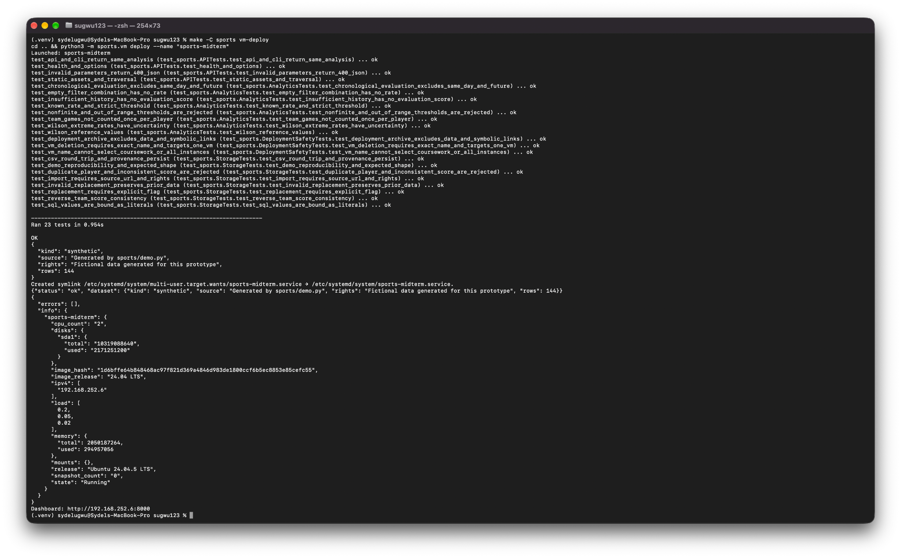

# Sports VM Deployment Verification

Sydel Ugwu

The automated sports application deployment was observed on the Mac on
October 1, 2026. The attached original terminal screenshot is the evidence
for the results below.

## Command

From the course repository root:

```bash
make -C sports vm-deploy
```

## Observed Results

| Check | Screenshot result |
| --- | --- |
| Dedicated project VM | sports-midterm launched |
| Tests inside the guest | 23 tests ran in 0.954 seconds; OK |
| Initial dataset | Synthetic; generated by sports/demo.py; 144 observations |
| Service setup | sports-midterm.service enabled |
| Service health | status: ok |
| Operating system | Ubuntu 24.04.5 LTS |
| VM state | Running |
| VM resources | 2 CPUs, approximately 2 GB RAM, 10 GB disk |
| Printed dashboard address | http://192.168.252.6:8000 |

The printed IP address is the address at the time of this run. Use
`make -C sports vm-status` to retrieve the current address after restarting.

## Evidence



*Figure 1. Original terminal screenshot showing the deployment command, passing
guest tests, healthy service response, and running sports-midterm VM.*

## Remaining Verification

- Open the dashboard from the Mac and inspect team/player/opponent analysis.
- Check the API from the Mac, beyond the health check inside the guest.
- Stop and start the project VM, then verify that the dataset and analysis persist.
- Replace the fictional demo with permitted historical data and evaluate it.
- Confirm and document formal instructor approval.

This deployment supports the solo sports project's storage, backend, and
dashboard infrastructure. It does not establish predictive performance on real
sports data or resolve the separate Week 5 cmx failures.
